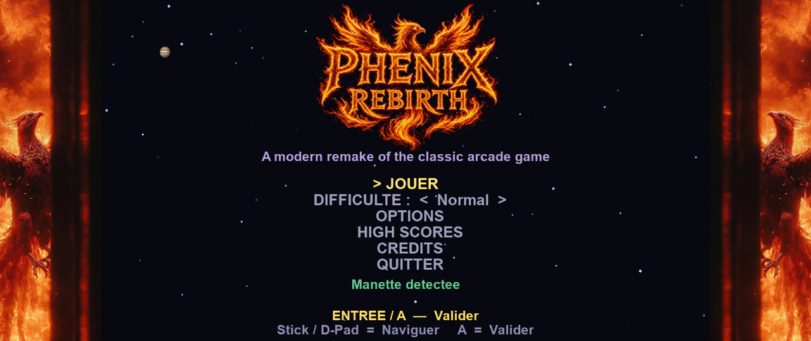
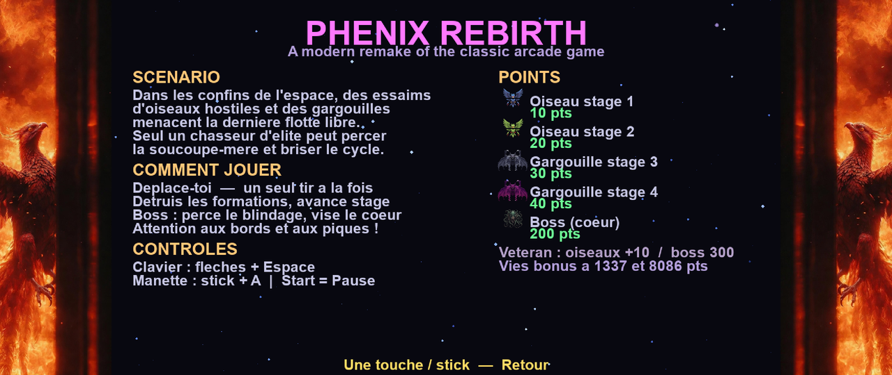
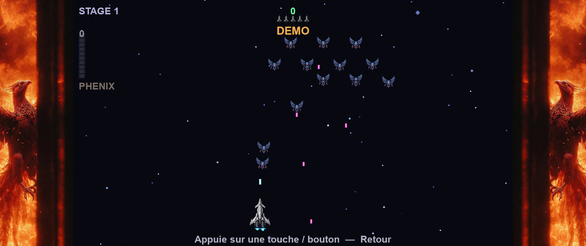

# Phenix Rebirth

**Version 1.1.0**

A modern, ultra-responsive PC remake of the classic arcade shooter **Phoenix** (1978 / 1980).

Free to play · Open source · MIT License

> **Unofficial fan project.** *Phenix Rebirth* is inspired by the arcade game *Phoenix*.
> It is **not** an official port, sequel, or product of Amstar Electronics, Centuri, Taito,
> or any related rights holder.

---

## Screenshots

| Menu | Help | In-game (demo) |
|------|------|----------------|
|  |  |  |

## Gameplay

[](https://youtu.be/NIiuKcSgEOk)

[Watch on YouTube](https://youtu.be/NIiuKcSgEOk) · [Play on itch.io](https://kraran.itch.io/phenix-rebirth)

## Features

- Faithful stage cycle inspired by the arcade original (birds → gargoyles → boss saucer)
- **PHENIX mode** — charge a gauge with accurate shots, transform into a firebird (invulnerable, faster, dual flame shots)
- Infinite progression: stages loop with rising speed after each boss
- Smooth 60 / 120 Hz play with delta-time movement
- Keyboard & gamepad (hot-plug while in menus; AZERTY Z + fire keys in menus)
- 1 player, 2-player **hot seat**, 2-player **coop** (separate scores & Phenix gauges, shared lives)
- Optional autofire (hold to shoot when the previous shot has left the screen)
- Local high scores (top 15, coop entries marked)
- 13 languages
- Attract mode (AI demo) + two-page help screen
- Difficulty: Novice / Normal / Veteran
- Optional CRT **scanlines** (3 intensity levels)
- Arcade bezels on ultrawide fullscreen (Phenix, Tesla, Blue, Flame)

## Requirements

- Python **3.10+** (3.11 / 3.12 / 3.13 recommended)
- [Pygame](https://www.pygame.org/) 2.5+

## Install

```bash
git clone https://github.com/Kraran/PhenixRebirth.git
cd PhenixRebirth
python -m pip install -r requirements.txt
```

## Run

```bash
python main.py
```

**Windows:** double-click `lancer.bat` (installs pygame if needed, then launches the game).

## Controls

| Action | Keyboard | Gamepad |
|--------|----------|---------|
| Move | Arrow keys / WASD | Left stick / D-Pad |
| Fire | Space / Up / W | A (or face buttons) |
| **PHENIX** activate / cancel | Left Shift / Right Shift / X | **B** |
| Pause | Esc | Start |
| Menus | Arrows + Enter | Stick / D-Pad + A · B = back |

- One player shot on screen at a time (classic Phoenix rule); dual shots only in PHENIX form.
- PHENIX gauge: **+1** per valid kill, **−1** per miss; activate from **3**. Cancel early with B / Shift to keep remaining gauge.

## Stages (cycle 1–5, then faster loops)

| Stage | Enemies | Points (Normal) |
|-------|---------|-----------------|
| 1 | Dark birds | 10 |
| 2 | Green / khaki birds | 20 |
| 3 | Gargoyles | 30 (body only; wings neutral) |
| 4 | Violet / dark-red gargoyles | 40 |
| 5 | Boss saucer + escort birds | Core 200 · cells 1 · decorations 50 |

- Veteran: bird scores **+10**, boss core **300**.
- Novice: slower enemies, 5 lives, no high-score entry; PHENIX lasts longer.
- Bonus lives at **1 337** and **8 086** points.

## Options

Persisted in `settings.json` (created at runtime, **not** shipped in the repo):

- Input mode, display (window / fullscreen / borderless)
- SFX & music volume
- Language (13 locales)
- FPS counter
- Scanlines OFF / 1 / 2 / 3
- Bezel style (fullscreen ultrawide)
- Reset high scores

Manual advanced key (edit `settings.json` when the game is closed): `monitor_index` for multi-monitor fullscreen.

## Project layout

```
PhenixRebirth/
├── main.py
├── lancer.bat
├── build_exe.bat
├── requirements.txt
├── LICENSE
├── VERSION
├── assets/          # sprites, music, SFX, logo
├── docs/screenshots/
└── src/             # game, player, enemies, boss, i18n…
```

## Development

Franck Fornasari (Kraran)

Music: *Phenix — Eternal Dawn*, *Eternal Dawn (Game Over)*, *Last Coin (Credits)* — created with [Suno](https://suno.com/@ffc059).

Tech: Python, Pygame, delta-time action loop.

## License

MIT — see [LICENSE](LICENSE).

## Disclaimer

This is a fan-made tribute. All trademarks belong to their respective owners.
